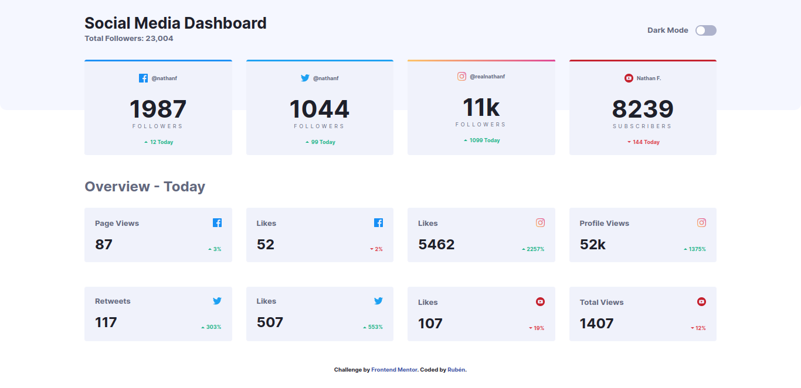
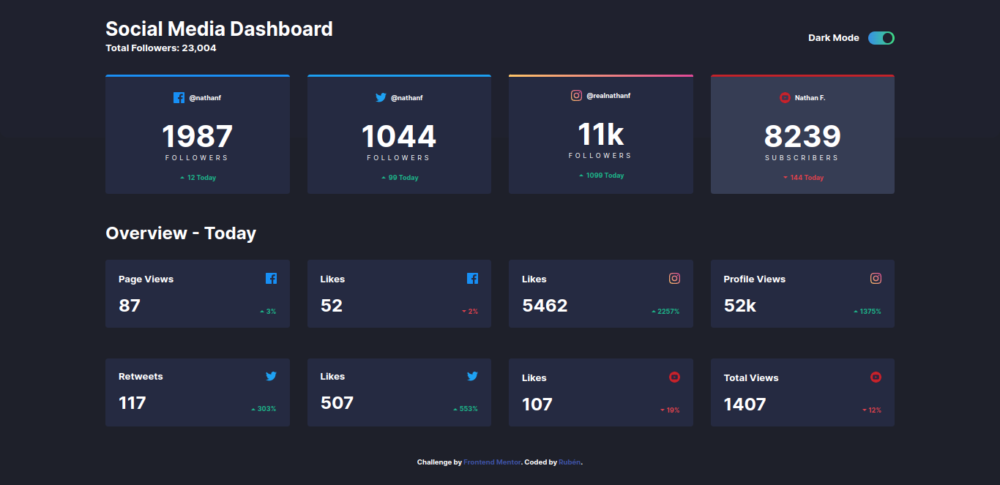
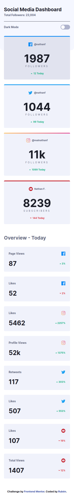
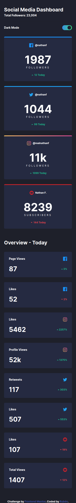
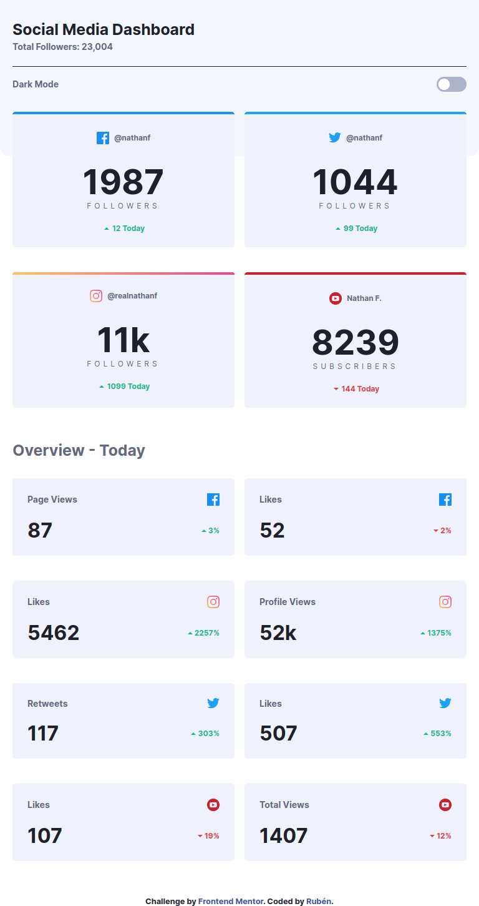
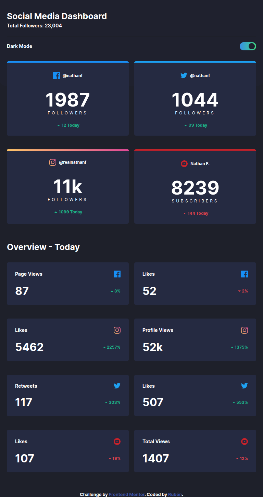

# Frontend Mentor - Social media dashboard with theme switcher

Visualizar resultado [clique aqui](https://social-media-dashboard-with-theme-switcher-master-amber.vercel.app/)

## Funcionalidades

- Preview em tempo real
- Modo tela cheia
- Responsivo
- GRID
- Flexbox

## 🛠 Habilidades

Javascript, HTML, CSS...

## Screenshots

### **Versão Desktop**

Dark mode

### **Versão mobile**

Dark mode

### **Versão Tablet**

Dark mode

